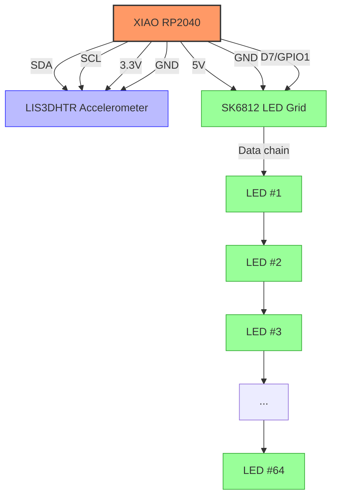

# PxlBoard

> ### More deets coming never 😊
> **Y**et **A**nother **G**eneric **N**eopixel **G**rid (**YAGNG**) except this one is mine so don't you dare dis it :kirby-gun:

## BOM

| Part | Quantity | Price | LCSC | Notes |
| --- | --- | --- | --- | --- |
| PCB (OSHPark) | 1 | $44.05 | | Purple PCB; Most expensive manufacturer but also looks gorgeous |
| PCB (JLCPCB) | 1 | $24.82 | | Custom PCB - Green; Mid-range price |
| PCB (PCBWay) | 1 | $12.80 | | Custom PCB - Various colors; Most affordable option (kinda suprisingly?) |
| Seeed XIAO RP2040 | 1 | $3.99 | [Seeed Studio](https://www.seeedstudio.com/XIAO-RP2040-v1-0-p-5026.html) | Brain of the operation |
| SK6812 LEDs | 65 | $6.40 | [C5380879](https://www.lcsc.com/product-detail/RGB-LEDs-Built-in-IC_OPSCO-Optoelectronics-SKC6812RGBW-WS-B_C5380879.html?s_z=n_rgbw) | RGB addressable LEDs; $0.0985 each, forms the 8x8 grid |
| LIS3DHTR Accelerometer | 1 | $0.60 | [C15134](https://www.lcsc.com/product-detail/Accelerometers_STMicroelectronics-LIS3DHTR_C15134.html?s_z=n_LIS3DHTR) | 3-axis accelerometer; same as the one used on the spark tilt jam |
| Capacitor 100nF - ceramic | 20 (min size) need 1 | $0.29 | [C24497](https://www.lcsc.com/product-detail/Multilayer-Ceramic-Capacitors-MLCC-SMD-SMT_Samsung-Electro-Mechanics-CL31B104KBCNNNC_C24497.html?s_z=n_1206%2520100nf) | 1206 package |
| Capacitor 10uF - ceramic | 10 (min size) need 9 | $0.34 | [C13585](https://www.lcsc.com/product-detail/Multilayer-Ceramic-Capacitors-MLCC-SMD-SMT_Samsung-Electro-Mechanics-CL31A106KBHNNNE_C13585.html?s_z=n_10uf%25201206) | 1206 package |
| Capacitor 100uF - electrolytic | 5 (min size) need 1 | $0.87 | [C1954161](https://www.lcsc.com/product-detail/Tantalum-Capacitors_Vishay-Intertech-TMCMA0J107MTRF_C1954161.html?s_z=n_100uf) | 1206 package |
| Capacitor 470uF - polymer | 5 (min size) need 1 | $0.59 | [C41410213](https://www.lcsc.com/product-detail/Polymer-Aluminum-Capacitors_Yunxing-SPT1AM471E09TRVZC_C41410213.html?s_z=n_470uf%252010v%2520polymer) | 10V 470uF Polymer ±20% SMD,D6.3xL9mm Polymer Aluminum Capacitors ROHS |

Total (with pcbway): ~$27.38

## Schematics

> If you want an iteractive version use [`kicanvas`](https://kicanvas.org/?github=https%3A%2F%2Fgithub.com%2Ftaciturnaxolotl%2Fpxlboard%2Fblob%2Fmain%2Fkicad%2Fpxlboard.kicad_pro)!

## Build Notes

Nothing yet

## Pinout & Wiring Diagram

### XIAO RP2040 Connections

| XIAO Pin | Connected To | Description |
| --- | --- | --- |
| D0/GPIO26/A0 | - | Unused |
| D1/GPIO27/A1 | - | Unused |
| D2/GPIO28/A2 | - | Unused |
| D3/GPIO29/A3 | - | Unused |
| D4/GPIO6/SDA | LIS3DHTR SDA | I2C Data Line |
| D5/GPIO7/SCL | LIS3DHTR SCL | I2C Clock Line |
| D6/GPIO0/TX | - | Unused |
| D7/GPIO1/RX | NEOPIXEL_SIG | LED Data In |
| D8/GPIO2/SCK | - | Unused |
| D9/GPIO4/MISO | - | Unused |
| D10/GPIO3/MOSI | - | Unused |
| 3V3 | LIS3DHTR VDD_IO | 3.3V Power |
| GND | LIS3DHTR GND, LEDs GND | Ground |
| 5V | LEDs VDD | 5V Power |

### LIS3DHTR Accelerometer

| LIS3DHTR Pin | Connected To | Description |
| --- | --- | --- |
| VDD | 3.3V | Power Supply |
| VDD_IO | 3.3V | Interface Power |
| GND | GND | Ground |
| SDA | XIAO D4 | I2C Data |
| SCL | XIAO D5 | I2C Clock |
| INT1 | - | Interrupt (not used) |
| INT2 | - | Interrupt (not used) |

### Wiring Diagram

### Capacitor Placement

- 100nF ceramic capacitor between VDD and GND of LIS3DHTR
- 10nF ceramic capacitors for each SK6812 LED (placed close to power pins)

	

	<i><code>&copy 2025-present <a href="https://github.com/taciturnaxolotl">Kieran Klukas</a></code></i>

	

